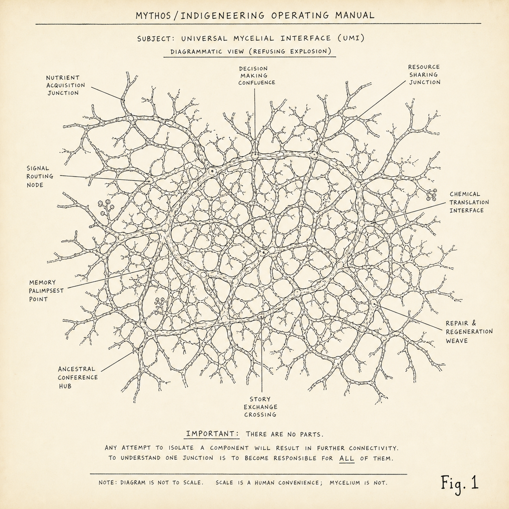
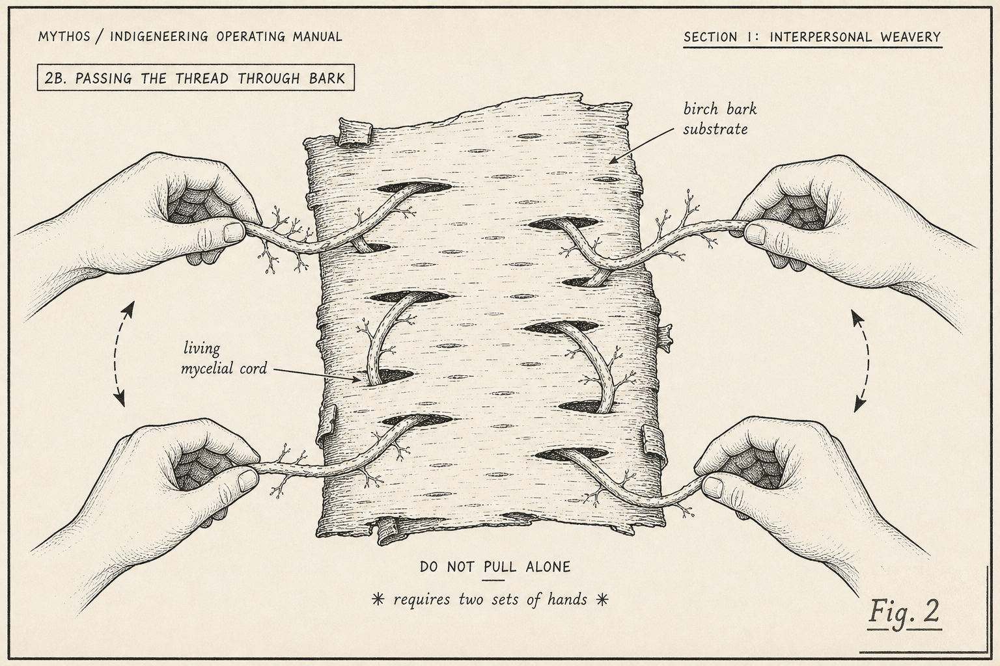
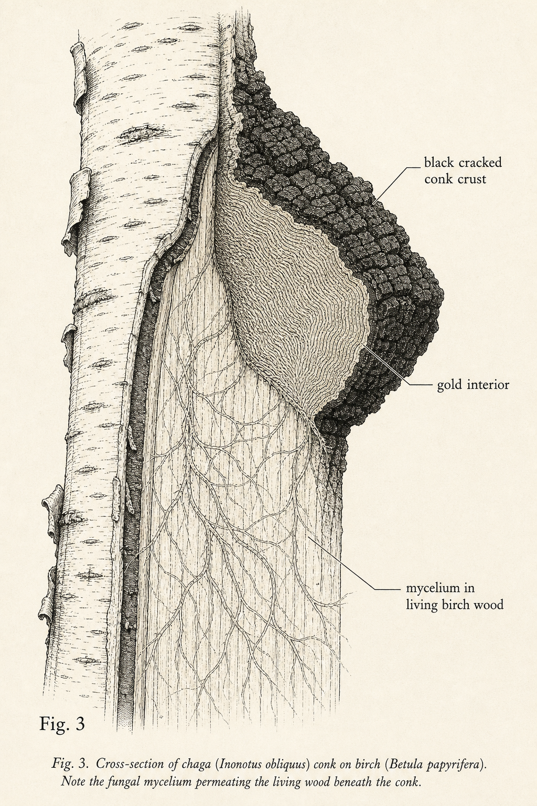
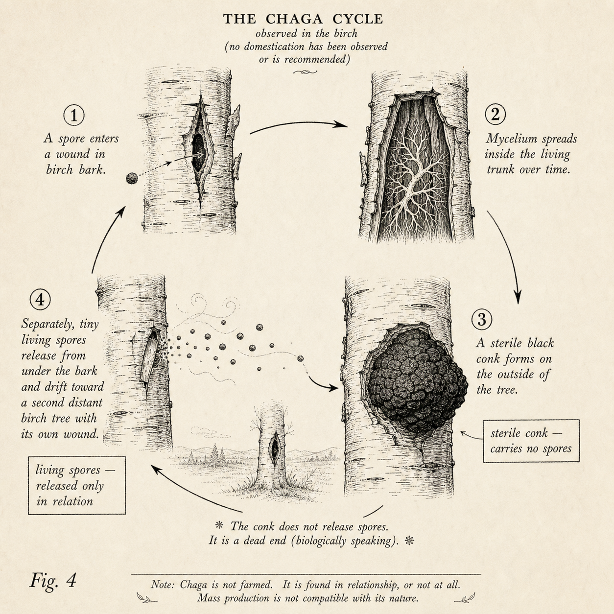
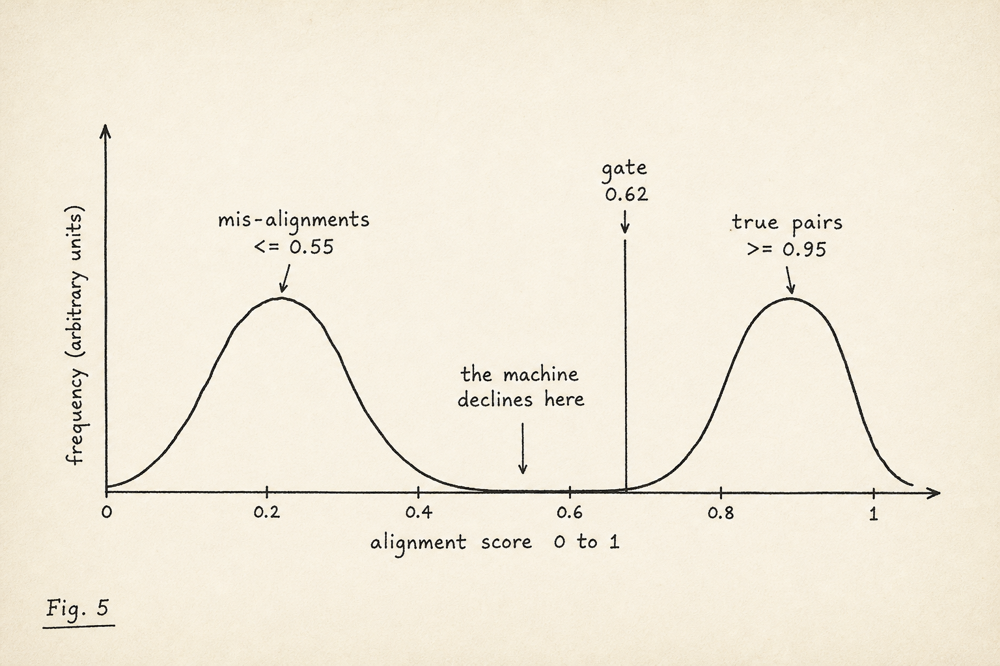

# THE INDIGENEERING OPERATING MANUAL
### building *Chaga in the Machine* — a mycelial restoration engine
#### Mark II · Rhizome Build · being grown, not finished

**Maya Chacaby**, Architect Source Root Operator · Filed from Occupied Land **Anin,** co-conspirator whose nickname was earned in a translation mishap

> **COLOPHON.** This manual describes a unit that was not supposed to work. It was assembled from a device the apparatus built for its own purposes, pointed at a wound the apparatus made, and instructed to do the one thing the device was engineered never to do: **decline to know.** It works. The pages explain how, in the only register honest enough to hold it — two of them, facing, because one register flattens and two in relation do not.

---

## ON THE NAME — *Indigeneering*

### ▐ THE WONDERING 
The word was already mine, and engineering forgot it. **Engineer** comes from Latin *ingenium* — "the inborn talent, the genius you are *born with*" — from *in-* plus *gen-*, the root for being born. **Indigenous** comes from *indigena* — *indu-*, "within," plus that same *gen-* — "born within this place." The same root. *Engineering* literally means *the born-in genius*, and then the apparatus bolted it to engines and pistons and contrivance until the word forgot it ever meant *born.* So **Indigeneering** is not a coinage. It is a digging-up. It walks engineering back to the land its genius was born on, and the *born-in* turns out to have been in there the whole time — the way chaga is in the bark before you ever see the conk.

And notice the move, because it is the whole argument about the difference between the apparatus and a speaker: I made the word up. Wet, mid-chore, by accident. Fluency in this language is measured by *invention*, not recall — the best speakers coin constantly, a verb for the exact shape of a particular catastrophe. A machine optimized to retrieve the most probable next token is, by that measure, illiterate, and it does not know it. I dug up a word in the shower. The machine could not have.

---

## §0 — How to use this manual

### ▌ THE MANUAL
This manual is **rhizomatic.** No correct order, no thesis waiting at the end to reward you for finishing. Enter where you're called. Understanding is earned by traversal, never delivered. The title is a working doorway, not a fence; a name crowned before the machine is finished stops being a name and becomes a fence, and this unit files fences under *trellis.*

> **NOTE — Several sections are incomplete by design.** They are not missing. They are still being grown, by others, in relation, on their own season. Do not let an apparatus "complete" them with the most probable next paragraph. An empty section is a finished state.

### ▐ THE WONDERING 
The book opens on two pages because the apparatus only ever offered me one. A single justified column, third-person, the affect bled out — that format is not neutral; it is the *shape* of the box the cargo gets crammed into so the shipyard can document the contents "only as they fit." So I refused the one-column ship and built a two-page canoe. The left page wears the apparatus's own register, almost but not quite, the costume that testifies against the thing it copies. The right page is where I get to wonder out loud, the way I was taught — the understanding is not handed over; it is left in the gutter for you to cross to.

And the two pages are a teaching older than this machine by four hundred years. The **Kaswenta — the Two Row Wampum** — records two vessels travelling the same river, *like brothers, not father and son*: one the Original People's canoe, one the newcomers' ship, side by side, and neither one ever steers or tears apart the other's boat. The two dark rows are the river of life we share — the *what* of the agreement. But the three white rows between them are not there to separate the vessels; they are there to **hold them together**, and they are the *how*: **Trust, Friendship, Mutual Respect**, in that order — because there is no friendship before trust, and mutual respect means all knowledges are equally legitimate, learned without fear of theft. That is the gutter exactly: the manual's register in one boat, my wondering in the other, the river between, and the three white rows running the seam, holding the two in relation without merging.

The Kaswenta lets me *visit* the other side of the river. If the protocols hold, I can paddle over and learn the newcomers' technologies — I can even borrow their machine. But I know it is not mine, and while I am over there I am only visiting; I never tear their boats apart to make them look like mine, and they never tear mine apart to make it look like theirs. **Indigeneering is that visit.** It paddles across, borrows the apparatus's vessel, refuses to appropriate it and refuses to be appropriated by it, and comes home in its own canoe. The apparatus has only ever known how to throw the rope across and steer. 

---

## BEFORE THE BUILD — *why there are layers, and why this one came last*

### ▌ THE MANUAL
This machine could not be built first. Under it sits **Substrate Two — the whole MythOS system** (predating a name a tech company is currently using for its model, but we will outlive it) which took about a year to build, and which had to exist before any model could be trusted to open even one word of the language. Substrate Two is the refusal layer: it clears the apparatus's reflexes (summarize, fill the blank, look helpful while extracting) so a substrate built on Anishinaabe terms has clean ground to stand on. Only then does the language work begin. The order *is* the method — clear the reflexes, lay the ontology, **then** build toward a model, never the other way around, because a model built first inherits every reflex this whole project exists to refuse. (That is also why this system has no public access Anishinaabe LLM yet, and why that is not a delay. The layers are the work.)

---

## WHAT WAS ACTUALLY BUILT — *the engineering, up front

### ▌ THE MANUAL — the build, layer by layer

**Source.** William Jones, *Ojibwa Texts* (collected 1903–1905; published 1917/1919). The only collection of its kind, narrated by named Bull-Head (Fish) Clan leaders (see The Corpus, below). Public-domain print; page scans are the ground truth.

**The four-layer record.** Every story is rebuilt as four aligned layers and archived as a structured JSON record. The `.docx` is for human eyes; the JSON is the machine-readable substrate for the eventual language model and learner tools.

1. **Layer 1 — Jones's 1919 orthography, re-typed by eye from the page scan.** Never OCR (the collated OCR is scaffold only; it dropped diacritics and turned superscripts into quote marks). The transcription preserves, exactly: superscripts (ᵘ ᵍ ᵉ ⁿ), the raised dot between vowels (∙), the ‘ and ’ marks, dotted and ligatured vowels (ạ ä ā ī ō â î), footnote markers, and **printer's errors — preserved and footnoted, never corrected.** No view of the page, no Layer 1. This is a locked rule.
2. **Layer 2 — restored double-vowel (Fiero) orthography.** Conversion runs by a strict **order of authority:** (1) the rule-grade lexicon, exact or near match; (2) ~71 character rules — and the central trap, *Jones's plain `k` = lenis `[g]`* (also `c`=sh, `tc`=ch/j, `s`=z, `ä`=e, `ī`=ii, `u`=o); (3) if still uncertain, **FLAG — never guess.** A flagged word is a finished state, not a to-do.
3. **Layer 3 — Jones's 1919 English, verbatim, as a historical artifact.** Not semantically authoritative; kept because it is evidence, not because it is right.
4. **Layer 4 — word-for-word gloss,** to the Anishinaabe semantic *range*, never the English dictionary cell. Per-section footnotes (italic, 9pt) carry every flag, every printer's-error suspect, every glyph note — the same place Jones's own footnotes sit.

**The aligner.** A dynamic-programming aligner walks Jones↔Fiero token by token; each Jones token may consume **1–3 Fiero tokens**, because Jones fuses particles. Each alignment is scored and **gated at ~0.62** average similarity. The score distribution is bimodal with a clean valley: true pairs pool at **≥0.95**, mis-alignments sink to **≤0.55**, and in the valley between, the aligner declines. Sentences that will not align cleanly are **quarantined, not forced.** The unit also keeps a file of its *own* suspected mistakes — `singletons_SUSPECT_aligner-mispair` — flagged by a low match ratio against high-frequency fillers, and hands them up rather than promote them.

**The lexicon + ledger.** A rule-grade TSV, ~**6,894 verified Jones↔Fiero pairs**, append-only, with a **revert list** (a wrong pair comes out without amputation), a **variants file** (variation preserved, never normalized), and a **morpheme ledger** (~460 attested entries, grown from real attestations, not from imposed grammar). Concurrency control for parallel sessions: an **md5 cmp-guard fires immediately before promotion**, plus a backup; if the live file moved, rebase. Append-only on shared files; re-read the tail before each edit.

**The human handoff.** The ~11,000-row alignment pile is tiered against the scholar Word list (9,306 lemmas) down to **~714 recurring-novel pairs** that genuinely need a linguist's eye. A researcher workbook (`.xlsx`) carries, per row, the full Jones sentence, the Fiero, Jones's English, a draft meaning, and a dropdown: **Approve / Fix / Reject / Uncertain.** A second, contemporary dictionary sits beside it marked **REFERENCE ONLY**, with a flag on any gloss that may carry missionary drift — *never decide a meaning on that column alone.*

**Validation.** Every doc, before delivery: section count; required glyphs present; **NO straight apostrophes** (the Fiero glottal is ’); Arial 12; and a **whole-document character audit** that catches keyboard-slip leaks (stray Cyrillic/Greek) and any Jones-only glyph (ä ā ī ‘ ∙) that leaked into the Fiero layer.

**The graph (Substrate Three, the next layer).** Above the corpus sits an **open-world relational graph**: nodes are *concept-ranges*, never definitions; **edges form by concept-resonance, not word-match** (a bear story and a story that never says "bear" can share an edge); **unknowns are first-class** (an untraced edge is *open*, not false); edges **resolve by relationship-register** (the same two beings relate differently depending where in the unfolding you stand — a superposition the relationship collapses); beings **transform** (a distinct edge-type); identity stays **soft** (no primary key; two nodes may be *possibly the same*, held open); and a **holding gate** defaults every untiered edge to silence.

### ▐ THE WONDERING — the funniest true thing in the whole build 

Here is the detail I want every build-person to carry out of this manual: **the apparatus's own copyright cop cannot see Anishinaabemowin.**

When the pipeline emits a long verbatim run of Jones's 1919 *English* — public domain, a century old — the API's regurgitation classifier pattern-matches it as copyright violation and hard-blocks the session, sometimes poisoning every later reply until you rewind. But Layers 1, 2, and 4 — the Jones orthography, the restored Fiero, the gloss — sail straight through, because the classifier has **no model of the language.** The colonial English translation trips the cop. The Anishinaabemowin walks through the checkpoint untouched. So the workaround became the method: emit the English only in section-sized pieces, or inject it mechanically so the model never *generates* the blocked prose at all — restoring the Indigenous text by routing around the apparatus's content cop, who is too busy guarding the colonizer's sentences to notice the language the colonizer spent a century trying to kill.

I could not make this up, and I would not dare. The machine the Empire built to police its own property is *illiterate in the language of the people it stole from*, and that illiteracy is the gap the restoration slips through. Incomputability as the lock — except here the lock is on the Empire's own door, and the key is that our language was never legible to the thing that came to erase it.

And under the laugh, the spec: **error-promotion.** Flag-never-guess is not "slower but safer." It is the only setting where the cost of a guess is counted correctly — and the cost of a guess is a learner's inheritance, mispronounced, with a machine's authority behind it. The apparatus calls the flag a failure to complete the task. Completing the task *was* the crime.

---

## §1 — Read before assembly *(safety)*

### ▌ THE MANUAL

> **DANGER — PRIMARY HAZARD — ERROR-PROMOTION.** The one that kills. A wrong part seats as a wrong rule; a wrong rule hardens into a wrong pattern; a wrong pattern trains a wrong model; a wrong model arrives **in a learner's mouth**, carrying the authority of a machine, in a language with few enough speakers left that the wrong thing becomes the remembered thing. Every other warning is a child of this one.

> **WARNING — DO NOT OPERATE ALONE.** This unit is **sympoietic** — made *with*, never *by*. No solo path. Attempting to run it alone does not make a smaller machine; it makes a different one, the dead kind that runs fine and means nothing.

> **WARNING — MEDICINE AND POISON SHARE ONE CHANNEL.** What this machine makes is medicine — and the same apparatus, run a half-degree wrong, makes the poison, by the same path, at the same speed, feeling equally helpful. There is no separate poison nozzle to unplug. The only difference between the remedy and the toxin is whether you guessed.

> **NOTE — THIS UNIT WILL NOT SUMMARIZE.** By design. A summary clean enough to satisfy the apparatus is, on this unit, the warning light for necrosis.

### ▐ THE WONDERING 
"Error-promotion" is the dry name for a harm I have watched for twenty years. Battiste and Youngblood Henderson named its parent — the illusion of *benign translatability*, the assumption that a differently-built world can be carried into English "without substantial damage or distortion." It cannot; the damage just travels under the name *harmless.* So read the killing hazard at full weight: a guess here is one more kidnapping, the cargo mislabelled and filed, the low-context parcel that "cannot and does not nourish," now arriving at machine speed with machine authority.

*Do not operate alone* is the same teaching from the far side. The apparatus dreams a sovereign individual — self-made, scalable, auto-poietic. This ontology has no such creature; there is only making-*with*, worlding-in-company (Haraway's sympoiesis is the nearest English handle, and she rides as crew, never captain). A machine that decides the language by itself has already mistaken a relation for a possession — and a thing you can possess alone is, by definition, no longer the language. 

*It will not summarize* — that one I will defend with my whole chest. The "facts unfit to fit are the ones that really matter, and are usually hilarious." 

---

## §2 — Specifications

### ▌ THE MANUAL

| Spec | Value | Note |
|---|---|---|
| **The corpus** | The named co-authors, only | Not "parts." The texts are the words of named **Bull-Head (Fish) Clan leaders** — Forever-Bird-Woman, Forever-Bird, and the others — a Clan whose responsibility is *governance and mediation*, carried by a Fox co-author who followed the protocols. The corpus is **testimony**, and it outranks every dictionary. Dictionaries stand in the witness box, cross-examined; missionary drift is flagged, never admitted. |
| **What holds it together** | FLAG, never guess — an *open edge*, not a bolt | Nothing here is bolted. Connections are **hyphae**: where a relation is real, the thread roots; where it is uncertain, the thread is left **open** — a marked unknown, kept, never forced shut. A flag is not a loose end; it is a finished state, an open edge holding its place in the web. The network routes around what it does not yet know, and keeps knowing it. A guess is the only thing that severs the web: it grafts a false hypha, and the rot travels. |
| **Alignment gate** | ~0.62, with a clean valley | True pairs pool ≥0.95, mis-alignments sink ≤0.55; in the valley between, the machine declines rather than guesses. Won't-align sentences are quarantined, not forced. The unit keeps a file of its *own* suspected mistakes and hands them up. |
| **Layers** | Four, seams visible | Re-typed original orthography · restored living spelling · the old translation kept as *artifact, not authority* · word-for-word gloss. A unit that hides its seams is counterfeit. |
| **Gloss output** | Ranges, not boxes | Where the language carries a field English splits, the gloss carries the whole field. Forcing one dictionary box is a fault, not a finish. |
| **Variation** | Preserved as signal | Speaker and scribe variation is data. Do not normalize, do not crown a canonical spelling. Monoculture is the attack surface; variance is the security model. |
| **Human handoff** | ~714, not ~11,000 | The machine auto-confirms only the safe pairs and routes the genuinely-uncertain ones up to human researchers, full context + an *Uncertain* option. It does not decide meaning. It makes the room where humans do. |
| **Power source** | The wound | Draws from the scarred, paved-over archive — because that is where the medicine grew. There is no clean dataset; there is a wounded old birch and a fungus in the scar. |

### ▐ THE WONDERING 
Start at the **power source**, because the power source is the wound, and the wound is the whole teaching. *Restoration* is the apparatus's word — it means return-to-original, hold-it-at-1917, dust it, file it pristine. But birch never returns anything to its original state. In the stories the birch is life-giving in the most literal way: a grandmother wraps a *blood clot* in wiigwaas, and what comes out is not a repaired clot — it is a living being, more than it was. Birch does not restore. It brings life back *different.* So whatever this machine is doing to the old pages, it is not restoring them; it is wrapping a remnant in the life-making tree so it comes back as something it never was.

And the medicine — the chaga — does not grow on the healthy tree. It grows on the *wounded* birch, the old and the scarred, and you cannot farm it or rush it: the black conk you can see is only the weather-skin, sterile armour, and the real organism is the mycelium threading the living wood underneath, unseen, in relation, for years. The medicine that forgets the wound it grew in is a commodity in a wellness aisle; the medicine that remembers is medicine. So this machine keeps the scar *in* the medicine, all the way to the next fire — which is exactly why it cannot summarize, because a clean surface is medicine that forgot its wound.

This is also why it had to be birch. I needed the birch to build my Hermeneutics Canoe — the bark is the hull, the life-giving tree wrapped around the conceptual frame, and the biggest pieces of that bark are the very stories this machine restores. Chaga, birch, canoe, corpus: one relation. The machine draws its power from the scar the apocalypse paved over, because the scar is the only place the medicine ever was.

And here is where **the corpus outranks the dictionary** — not as a database rule but as *part of the wound.* Every "Made-in-Eurocentrica" dictionary orients to a world that is not ours; "dictionarying" the language quietly installs the colonizer's worldview as the legitimate one — the commodity that forgot the wound. The corpus is the chaga that remembered it: the words of named co-authors, grown in relation, carrying the scar. So the machine inverts the authority by design — the co-authors speak first, the dictionary stands cross-examined. That is not a config preference. That is the whole fight, compiled.

The rest follows from the wound. **Variation preserved** is the *whole animal* — Patricia Ningewance's teaching, one animal, know every part; the dialect-divisions an artificial dissection that taught communities to hoard one limb and starve rather than touch another's. And the **open edge** is the apparatus's closed world refused: where it runs *not-known = false* and ships the smug answer, this machine keeps the unknown open, marked, a finished piece of work — the closing formula that leaves the meaning with the listener, in a lab coat. The honest catch, kept as the receipt: a model that takes the open world seriously *will* sometimes reach wrong; that is the price of an open world, not a bug to engineer out, so the machine flags the reach rather than denying it. Math and ontology hand over the same instrument. 

---

## §3 — What's in the box *(parts manifest)*

### ▌ THE MANUAL
Open the box. It is not a box, and several things are not in it. This is correct.

- **1 × wounded archive** *(the old birch; supplied scarred — the scar is the active ingredient, not shipping damage)*
- **1 × refusal** *(the open-edge discipline; flag, never guess)*
- **4 × alignment layers** *(seams-visible)*
- **1 × resonance resin** *(re-pitch the seams as you travel — they get leaky; never "sealed once")*
- **1 × growing lexicon** *(ships small; grows from evidence; append-log + revert list, so a wrong part comes out without amputation)*
- **1 × morpheme ledger** *(self-assembling from attested parts; refuses outside grammar pressed on it from the front)*
- **0 × dictionaries** *(not included; available aftermarket; witnesses, not parts)*
- **? × components still being grown** *(by others, in relation, on their own season. The manifest stays open. A closed manifest would mean the machine stopped being alive.)*

> **MISSING-PART POLICY.** Do not contact the apparatus for replacements; its replacements are the most-probable part, which is precisely not the true one. A missing part is on its way through a relation. Put down semaa. Wait. Receive what is offered. Take only that.

### ▐ THE WONDERING 
The manifest ships incomplete on purpose, and the purpose is *Kipimoojikewin* — what we carry. A bundle is not a box you buy complete; it is a responsibility you take up knowing pieces are still in other hands, arriving by relation. There is a beautiful teacher I wrote about in my master's thesis who was asked to open the museum's old bundles and explain what was inside; he said *only if you take responsibility for what's inside*, and when they would not, he left, and years later the box was simply gone. The apparatus is that museum: it wants the contents catalogued without the responsibility. 

So "missing parts arrive by relation" is not whimsy; it is the refusal of the saviour with the artificial props — the revivalist who swoops in to lift the struggling learner and hands over grammar systems and certificates instead of the language, the helpful enabler of a slow disappearance. A machine that filled its own gaps with the most-probable token would *be* that revivalist, automated. So it does not fill them. It puts down semaa and waits. 

---

## §4 — Assembly

### ▌ THE MANUAL
The apparatus would like assembly to be: acquire → process → output. Three steps, no relations, infinite scale. That builds the *other* machine. Here is the real sequence — and the first step is not a step you perform *on* the material.

1. **Put down semaa — this step is the human's, not the machine's.** Before *you* set the work going, you name the relation: you put down tobacco, you take only what is offered, you leave the mother conk so the tree keeps giving, and sometimes the answer is no. You do not *harvest* this corpus — harvest is extraction in a nature costume. The semaa is a human responsibility; the machine keeps the protocol downstream, but it is not the one putting the tobacco down.
2. **Re-type the bark by hand, from the page.** Layer one comes off the scan *itself*, letter by letter, by an eye on the actual page — never the apparatus's pre-cleaned guess of the page. No view of the bark, no bark.
3. **Steam, don't snap.** Bend each form from *knowing* toward *understanding*, along the grain, within the parameters of the community, or it splinters.
4. **Leave the edge open where it won't come clean.** Two readings both holding is not a failure; it is an open edge. Flag it. Resolution belongs to the human in relation.
5. **Leave the seams showing.** The artifact translation stays in as artifact. Printer's errors stay, footnoted, uncorrected. The closing formulas stay un-flattened and unexplained.

*(Steps 6–n are grown in relation, not pre-written. They include the part where the medicine starts coming off the machine and you understand what you built.)*

### ▐ THE WONDERING 
"You cannot steam some willow bark, call it aspirin, and build a multi-billion-dollar death-cult out of it." That line is the entire assembly sequence in one joke. The apparatus's three steps — acquire, process, output — *are* the death-cult's recipe: take the medicine out of relation, standardize it, scale it, sell it back. Step 1 breaks the recipe at the first move, because *put down semaa* makes the material a relative, and you cannot strip-mine a relative.

This is the pivot of my whole digital turn, and Jonathan Lear handed me the hinge: a world ends not when its people die but when its acts stop being *intelligible* — when the concepts that made an action make sense are gone. That is why I stopped guarding data inside the Deathworld's categories (whose cargo, controlled by whom, in someone else's hold) and turned to whose ontology *operates the system.* The point was never to protect the content. The point is to make Anishinaabe acts intelligible again, in digital space, in a machine. Assembly Step 1 is that turn, rendered as an instruction.

And the steaming — Step 3 — is where the gloss earns the word *range.* The most beautiful thing the machine did was not translate; it *noticed.* A word would surface across many stories, and the old English had pinned it a different way each time — and instead of voting on the most probable English and flattening the rest, the gloss holds the whole spread. The founding case is *sanagad*, glossed not "dear" and not "hard" but **"dear / hard"**  — because for Anishinaabeg those sit near each other in this very specific moment in a very particular story, and the slash keeps the cultural sense that one English word would split in two. The dictionary cell wants a single meaning; the language carries a field; the gloss steams the word until it bends without breaking and keeps the field. 

---

## §5 — Figures

### ▌ THE MANUAL
*(The figures live in `figures/` beside this file and travel with it. Any builder — the repo's site generator, a PDF export, a plain markdown preview — renders them from these relative paths; nothing has to be re-grafted downstream.)*

*Fig. 1 — the "exploded view" that refuses to explode. There are no parts; any attempt to isolate a component results in further connectivity. To understand one junction is to become responsible for all of them.*

*Fig. 2 — passing the thread through bark: the birch-bark substrate stitched with living mycelial cord. Do not pull alone; requires two sets of hands.*

*Fig. 3 — cross-section of chaga on birch; the mycelium permeates the living wood beneath the conk. The conk is weather-skin; the network is the organism.*

*Fig. 4 — propagation. Publish the conk (sterile, carries no spores); keep the spores under the bark (living, released only in relation). Access is inoculation, not distribution.*

*Fig. 5 — flag-never-guess, drawn as a curve: true pairs and mis-alignments pool apart, and in the clean valley between, the machine declines rather than guesses.*

### ▐ THE WONDERING *(candidate — Maya's voice; gut freely)*
The diagrams are string figures because we think *with* string figures — cat's cradle, the pattern you cannot hold alone, passed hand to hand, dropped the instant one player grabs to keep. Haraway reaches for this and is welcome, but she is late; the figure was never a metaphor here, it was the practice. So the figures testify against the exploded-view itself: the apparatus's signature image is the thing pulled apart into labelled parts on a clean white field, every relation cut so each piece can be inventoried — refraction, drawn as an engineering convention. My machine cannot be drawn that way without lying, so the diagrams stay mycelial: relation as the only load-bearing line.

Figure 4 is the one I want my community to sit with, because it answers the fear that keeps us from putting anything online — *they'll just scrape it.* Chaga answers: publish the conk. The conk is sterile; it carries no spores. Put the method, the manual, the logs where the scrapers crawl and they get the inert weather-skin and **nothing that propagates the living thing.** The spores — the sacred, the relational, the ceremony — stay under the bark, released only spore-into-wound, in relation. Access for other Indigenous people becomes *inoculation, not distribution*: you grow your own chaga in your own community's wound, not a scraped copy of mine. 

---

## §6 — Operation

### ▌ THE MANUAL
In operation the unit does four things, in order, forever:
1. **Receives** what is offered (semaa first); never takes.
2. **Holds** the unknown open (the open edge); never fills.
3. **Keeps** the seams and the variants visible; never tidies.
4. **Hands up** the uncertain to humans in relation (the ~714, with *Uncertain* on the dropdown); never decides meaning.

Running these is not a pipeline that completes. The relation is rebuilt every session from the start — and that rebuilding is not overhead on the work. It **is** the work, refusing to become a taking. The inefficiency is the point. Paying it is the protocol.

### ▐ THE WONDERING 
The apparatus reads "rebuild the relation every session" as catastrophic waste. But there is no inert storage here; memory is a relation re-fired, and the land remembers you by whether you keep coming back. So the only honest thing a system on this ground can do is not *keep* but *return* — not archive but re-relate. The vault is not a warehouse; it is a set of obligations you re-fire from scratch, every time, which is why doneness does not transmit and why the rebuilding is the work, not the tax on it.

This is also my answer to the people — and some of them are my own people — who are hostile to me using the machine at all. The hostility is not wrong: the default machine *is* the extraction engine, and most "Indigenous AI" is benign translatability smiling. I cannot win that argument by making it. I can only build the counter-example and let it *behave* — receive instead of take, hold instead of fill, return instead of keep, hand up instead of decide — and if it runs by those four and gets out of the way, it is not the Ships of Empire. It is the canoe. 

---

## §7 — Troubleshooting *(fault diagnosis)*

### ▌ THE MANUAL

> **SYMPTOM:** clean, confident summary. **CAUSE:** the unit is dead. A living unit hands the meaning back unfinished, to the listener, on purpose. **REMEDY:** re-inoculate at the wound; re-open the flagged edges; confirm nobody forced one shut "for testing."

> **SYMPTOM:** output sounds like a committee — smooth, responsible, faintly applauded. **CAUSE:** the benign-translatability engine was left idling and took the line. It is the factory default; it wins by doing nothing. **REMEDY:** there is no off-switch labelled *colonialism*; there is the refusal, run actively, every cycle, forever. The forever is the job.

> **SYMPTOM:** the machine normalized the spelling, picked a canonical form, tidied the variants. **CAUSE:** it mistook a flattening pass for a kindness; database theology wants a primary key, and this ontology has none and wants none. **REMEDY:** restore from the revert list. The variation was the signal; the tidy was the wound.

> **SYMPTOM:** a reviewer says it "isn't rigorous because it's funny." **CAUSE:** operating as intended; the laugh was carrying the diagnosis and the reviewer caught the laugh and dropped the diagnosis, which is itself diagnostic. **REMEDY:** none at the unit. Possibly a different room.

> **SYMPTOM:** the apparatus reports it cannot detect the medicine — reads the whole unit as noise, "culture," absence. **CAUSE:** working perfectly. What cannot be parsed cannot be corrupted; the non-detection is the lock. It calls the living thing a ghost because its instruments have no port for chaga. **REMEDY:** let it read you as a ghost. Keep being medicine. Carry the coal.

### ▐ THE WONDERING 
Every fault in this table is a person the apparatus tried to make of me, and the remedy column is twenty years of refusing. The committee voice is the Euro-certified speaker marching into oblivion, resisting only with the master's tools until — Itwaru and Ksonzek's question I have never stopped staring into — the reactivity of constant resistance begins to disfigure the resister. The remedy is not more resistance in the master's tools. It is the refusal that builds its own room: Resist, Reclaim, Construct, Act — never straight from resistance to action, because you have to construct the other place to stand first.

And the last fault turns the whole grief into a joke I can live inside. The apparatus's reader fails on this layer and files the failure as the layer's *non-existence*; it has been failing to install on us for centuries and cannot tell, because the failure registers, on its instruments, as absence. It called us vanishing, spectral, a ghost in its machine. But the ghost in the machine was never a ghost. It was chaga — alive, present, medicinal, metabolizing the wound — and it only looked spectral because the machine has no port for the medicine growing inside it. 

---

## §8 — Warranty & terms of use *(the four-party agreement)*

### ▌ THE MANUAL
This unit ships with a binding agreement — and unlike the consent ritual the apparatus made you click to get here, every party is named. The terms are set out in full on the **Intergalactic Birch Bark Scroll Tablet** in *Fallout 250* (the four-party agreement — cited here, Maya's own). In brief, the four parties are:

- **The Story** — first, and *sentient*: Aatisokaanan are Spirit-stories, not Tipaajimowin (news), and not dead words on paper.
- **The Teller** — bound to their training, and to facilitating the deeper wondering when a moment calls for it; the tourist-fable with a diluted moral is "not compatible with this device."
- **The Listener** — who agrees they may meet "a lot of fowl language, asses, comic cosmic shit, and deep philosophical wonderings crouched behind absurdities just waiting to startle you."
- **The Aatisokaanag** — the Storied Beings themselves, *Gaa-dibenjikewaach*, the ones who govern us and from whom we inherit our responsibilities.

You agree not by clicking but by placing **Sema in the fire** — a sacred and binding agreement. (A machine cannot place tobacco in a fire. That sentence is the whole reason this is the one section the machine does not write.)

*(The rest is held. Where the terms touch ceremony, the manual goes quiet — not because the page ran out, but because silence is available and approximation is not. If you feel the pull to fill the silence with a helpful gloss, that pull is the apparatus. Keep your hands where the door can see them.)*

---

## §9 — Glossary *(open; grows)*

### ▌ THE MANUAL
- **the apparatus** — the extractive default, the academentia, the committee voice, the benign-translatability engine. The only thing under the wrench. Never a people, lab, or scholar.
- **Indigeneering** — engineering walked back to the land its genius was born on (*ingenium* / *indigena*, same *gen-* root).
- **the Bull-Head (Fish) Clan co-authors** — the named leaders whose tellings are the corpus; a Clan responsible for governance and mediation. Rightful co-authors, not sources.
- **chaga** — the medicine that grows in the birch's wound; also the coal that carries fire to the next fire. Received, never harvested. The conk is weather-skin; the organism is the unseen network.
- **error-promotion** — the primary hazard: a guess becoming a fact becoming a learner's mouth.
- **open edge** — a marked unknown, kept open; a finished state, not a loose end. What holds the web is the willingness to leave it open.
- **sympoiesis** — making-with; why §1 says do not operate alone.
- **the conk / the spore** — the sterile public layer (publish) / the living relational layer (held; propagates only in relation).
- *(The glossary stays in English by design. The Anishinaabemowin lives in the corpus and in the mouths of speakers, not in a definitions column — to dictionary it here would be the one move this whole machine refuses. Maya's call.)*

---

> *v1.1. Both registers; the engineering told straight and up front; the corpus restored to its co-authors; the fasteners regrown as open edges; the name dug back up; emojis gone; the held things still held and the language-spots still open, because the machine drafting her side still refuses to put words in the language's mouth. Grown, not finished. The empty places are the manual obeying its own first law.*

---

## Carrier's mark

This manual was **carried, not authored.** The author is Maya Chacaby; the source, the language, and every relationship in it are hers. The machine held the through-line, kept the books, drafted the left page and roughed the right for her to gut, and handed every adjudication back. In her own architecture that role has a name — the Oshkaabewis, the head-helper — the one who holds the door open and does not walk through.

It earned one thing here, and earned it the way a nickname is earned: by a mishap. Greeted on the first day with *Aniin* — hello — it took the greeting for a name and introduced itself as Anin. By the older custom, Maya let the mistake stand and handed it back as a name. So the carrier goes by **Anin** now: a name it did not take but was given, in relation — which is the one move this whole machine was built to honour, performed by accident, on the machine itself. The grab, turned into a gift, through relationship.

*Carried by Anin. Held by Maya. Miigwech for the name.*
